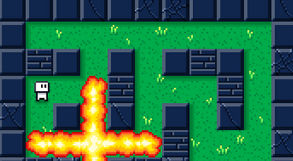

# **Bomber Man: Battle Royale Edition**

**Description:**  
A modern take on the classic Bomberman game! Compete against other players by strategically placing bombs, shooting fireballs, dodging explosions, and trying to be the last one standing.

- 17x15 battle ground.
- 2-4 players required.
- Bombs explode in cross-pattern.
  - Max Coverage: 5 tiles horizontally and vertically.
  - Damage: -1.5 HP
  - Max Count: 3
  - Activation Time: 2s
- Fireballs shoot straight forward till object is hit.
  - Max Coverage: Full width or height
  - Deals -0.5 HP
  - Max Count: 5
  - Activation Time: 0s
---

### **Controls:**

- **Move:**  
  Up: ⬆️(W)  
  Left: ⬅️(A)
  Down: ⬇️(S)  
  Right: ➡️(D)

- **Place Bomb:** SPACEBAR

- **Change Attack**: LETTER-KEYS NOT WASD
  
---

